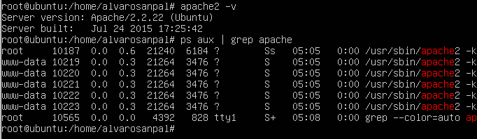

#PRACTICA 1

En esta práctica se ha hecho la instalación de la maquina virtual, así como la instalación de LAMP, SSH y cURL.

##Capturas

Captura de los comandos "apache2 -v" y "ps aux | grep apache" en la Maquina 1.

Captura de los comandos "apache2 -v" y "ps aux | grep apache" en la Maquina 1.

###Fin de la Práctica 1.
