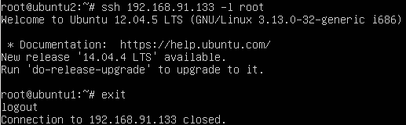
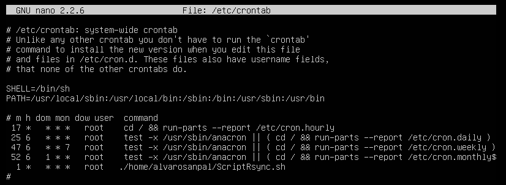

#PRÁCTICA 2

Al principio de la práctica se instala el rsync, ejecutando el comando "apt-get install rsync".

Después probamos el funcionamiento del rsync clonando la carpeta /var/www/ de la máquina principal a la máquina secundaria.

Tras ello, hacemos los pasos para generar unas claves SSH para que nos permita conectarnos desde la máquina secundaria a la máquina principal sin pedirnos autentificación.

De los pasos para generar las claves SSH y copiar la clave pública en la máquina 1 no tengo captura, porque instintivamente despues de dichos pasos ejecuté el comando "clear".

Pero a continuación adjunto una captura demostrando la conectividad SSH de la máquina 1 a la máquina 2 sin necesidad de autentificación y sin ningun problema.

Lo siguiente visto en la práctica es el programar tareas con CronTab, en mi caso he creado un script con la orden de rsync vista anteriormente, y la he añadido a crontab para que se ejecute dicho script en el minuto 1 de cada hora.

Aqui introduzco una captura del archivo crontab para que se vea como queda la orden de que se ejecute mi script:

Como se observa en la imagen, en la ultima orden, está puesto que se ejecute con privilegios de root el script cada hora en el minuto 1.

###Fin de la Práctica.

