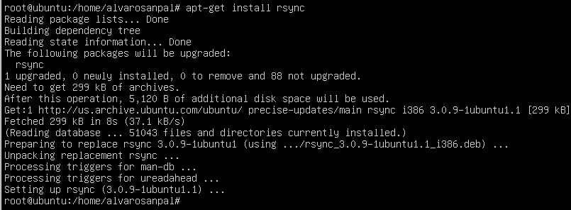
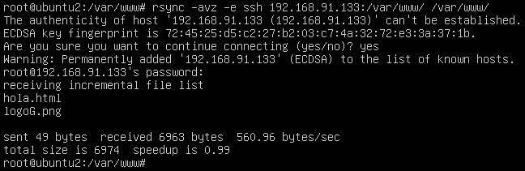

#PRÁCTICA 2

Al principio de la práctica se instala el rsync, ejecutando el comando "apt-get install rsync".

Después probamos el funcionamiento del rsync clonando la carpeta /var/www/ de la máquina principal a la máquina secundaria.

