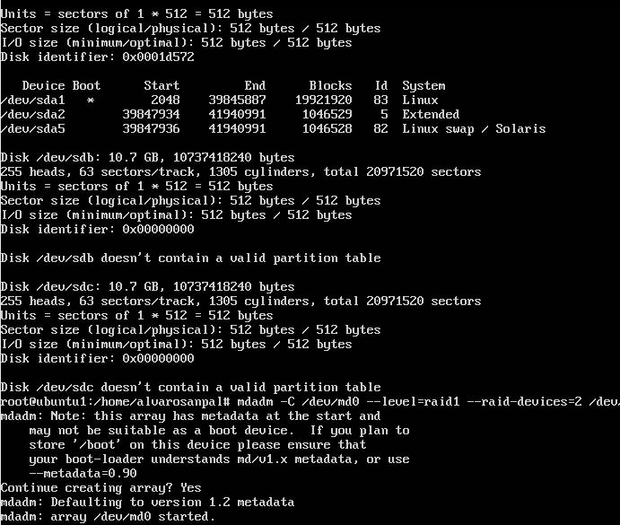
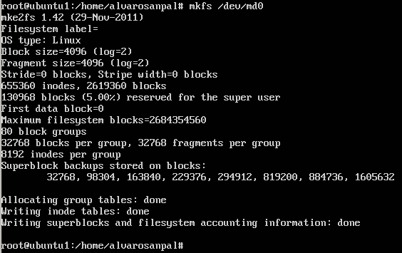
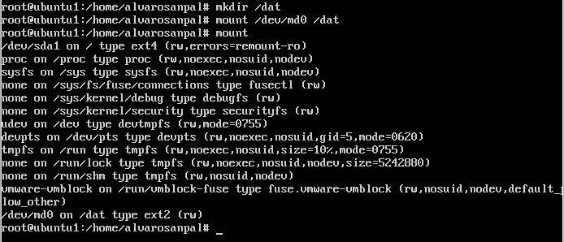
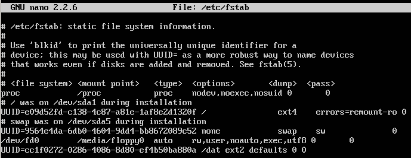
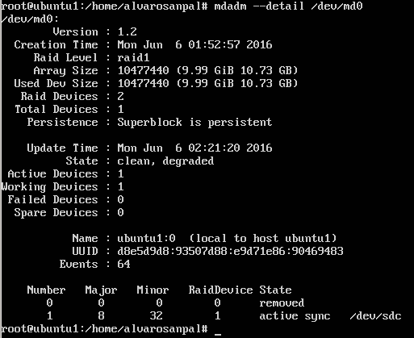

#Práctica 6

En esta práctica se configurarán dos discos RAID añadidos al sistema, se montarán
y se procederá a simular fallo en uno de ellos, a eliminarlo "en caliente" y a volver a agregarlo del mismo modo.

Para comenzar, deberemos añadir dos discos SCSI a la máquina apagada, en mi caso he
añadido dos discos de 10 GB cada uno.

Una vez añadidos los dos discos, podemos arrancar la máquina y seguir el guión de prácticas.

Será necesario instalar el software de mdadm, con el comando "sudo apt-get install mdadm"

Después buscaremos información sobre los discos del sistema, y a continuación podremos crear el
RAID 1, usando el dispositivo /dev/md0 y añadiendole los dos discos creados: /dev/sdb y /dev/scd.

Ahora le daremos formato al dispositivo con "sudo mkfs /dev/md0" y ya podremos crear el directorio en el que se montará la unidad RAID.

A continuaíon dos capturas de los pasos anteriores:

Ya está el raid configurado, ahora modificaremos el archivo /etc/fstab para que la unidad se monte al iniciar el sistema operativo:

Hasta aqui la configuración del RAID, ahora adjuntaré tres capturas, referentes al fallo en el disco, la retirada "en caliente" del disco
y la nueva agregación del mismo.

A continuación dos capturas, ambas muestran la informacion del dispositivo MD0, la primera es cuando los dos discos estaban en funcionamiento,
la segunda es despues de haber simulado el fallo en uno de los discos y haberlo eliminado:

.png)

###Fin de la práctica 6.
